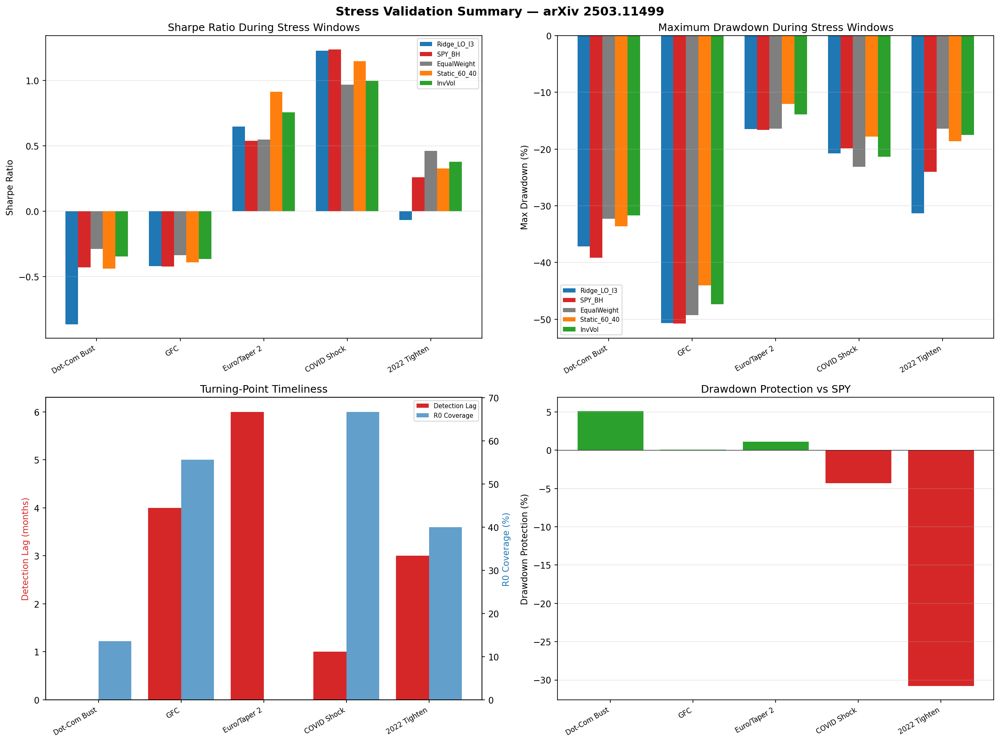

# Stress Validation Execution Report — arXiv 2503.11499
**Date:** 2026-03-13 23:27
**Pipeline:** Two-layer K-means regime detection → Ridge regression → Long-only top-3

---

## 1. Methodology

### 1.1 Walk-Forward Stress Validation Protocol

For each crisis window, we run the **full pipeline in walk-forward mode**:

1. **Data**: Expanded FRED-MD macro series (~104 transformed variables → 49 PCA components)
2. **Regime detection**: Two-layer k-means (crisis isolation + 5 normal regimes)
3. **Forecasting**: Ridge regression with 48-month rolling training window
4. **Portfolio**: Long-only top-3 ETFs from 10 sector ETFs (SPY, XLB, XLE, XLF, XLI, XLK, XLP, XLU, XLV, XLY)
5. **Evaluation**: Monthly rebalancing, no lookahead bias

### 1.2 Benchmarks

| Benchmark | Description |
|-----------|-------------|
| **SPY Buy & Hold** | 100% SPY, no rebalancing |
| **Equal Weight** | 1/10 in each sector ETF, monthly rebalanced |
| **Static 60/40** | 60% SPY + 13.3% each XLP/XLU/XLV (defensive tilt) |
| **Inverse Volatility** | Weights inversely proportional to trailing 12m volatility |

## 2. Crisis Windows and Rationale

| Window | Period | Type | NBER Recession | Rationale |
|--------|--------|------|----------------|-----------|
| **Dot-Com Bust** | 2000-03 to 2002-10 | Secular bear / tech bubble | Yes | Gradual deflation of tech bubble + 9/11 shock. Tests regime detection on slow-on... |
| **GFC** | 2007-10 to 2009-03 | Systemic financial crisis | Yes | Deepest post-war recession. Macro variables deteriorated broadly (employment, cr... |
| **Euro/Taper 2011** | 2011-05 to 2011-10 | Sovereign debt / growth scare | No | US equity drawdown ~19% driven by European contagion fears + S&P US downgrade. N... |
| **COVID Shock** | 2020-02 to 2020-04 | Exogenous pandemic shock | Yes | Fastest bear market in history (34 days). Extreme V-shape recovery. Tests detect... |
| **2022 Tightening** | 2022-01 to 2022-10 | Monetary tightening / inflation | No | Fed hiking cycle from near-zero to 4%+. SPY drawdown ~25%. No NBER recession des... |

## 3. Walk-Forward Results by Crisis Window

### 3.1 Dot-Com Bust

**Window:** 2000-03 to 2002-10
**Type:** Secular bear / tech bubble
**Rationale:** Gradual deflation of tech bubble + 9/11 shock. Tests regime detection on slow-onset, non-macro-driven bear market. NBER recession Mar-Nov 2001 embedded within broader drawdown.

| Strategy | Sharpe | Sortino | MaxDD | Ann. Return | Ann. Vol | Cumulative |
|----------|--------|---------|-------|-------------|----------|------------|
| Ridge_LO_l3 | -0.865 | -1.294 | -37.2% | -14.2% | 16.4% | -32.3% |
| SPY_BH | -0.43 | -0.688 | -39.2% | -8.5% | 19.7% | -22.9% |
| EqualWeight | -0.289 | -0.46 | -32.3% | -5.3% | 18.5% | -16.1% |
| Static_60_40 | -0.44 | -0.688 | -33.6% | -7.3% | 16.7% | -19.6% |
| InvVol | -0.345 | -0.554 | -31.7% | -6.0% | 17.3% | -17.0% |

**Turning-Point Timeliness:**
- Detection lag: **0 months**
- Exit lag: **0 months**
- R0 coverage: **13.6%**
- R0+R3 coverage: **13.6%**

**Drawdown Protection vs SPY:** +5.1%

### 3.2 GFC

**Window:** 2007-10 to 2009-03
**Type:** Systemic financial crisis
**Rationale:** Deepest post-war recession. Macro variables deteriorated broadly (employment, credit, output). Primary validation case — if the model fails here, it fails everywhere.

| Strategy | Sharpe | Sortino | MaxDD | Ann. Return | Ann. Vol | Cumulative |
|----------|--------|---------|-------|-------------|----------|------------|
| Ridge_LO_l3 | -0.42 | -0.57 | -50.7% | -9.3% | 22.1% | -30.5% |
| SPY_BH | -0.424 | -0.594 | -50.8% | -8.6% | 20.3% | -28.1% |
| EqualWeight | -0.336 | -0.469 | -49.3% | -6.9% | 20.6% | -24.4% |
| Static_60_40 | -0.389 | -0.528 | -44.1% | -6.8% | 17.4% | -22.7% |
| InvVol | -0.364 | -0.494 | -47.3% | -7.0% | 19.4% | -24.1% |

**Turning-Point Timeliness:**
- Detection lag: **4 months**
- Exit lag: **4 months**
- R0 coverage: **55.6%**
- R0+R3 coverage: **55.6%**

**Drawdown Protection vs SPY:** +0.1%

### 3.3 Euro/Taper 2011

**Window:** 2011-05 to 2011-10
**Type:** Sovereign debt / growth scare
**Rationale:** US equity drawdown ~19% driven by European contagion fears + S&P US downgrade. No US NBER recession. Tests whether model avoids false-positive crisis detection on external shocks.

| Strategy | Sharpe | Sortino | MaxDD | Ann. Return | Ann. Vol | Cumulative |
|----------|--------|---------|-------|-------------|----------|------------|
| Ridge_LO_l3 | 0.649 | 1.199 | -16.5% | 9.5% | 14.6% | 13.5% |
| SPY_BH | 0.538 | 0.881 | -16.7% | 8.5% | 15.8% | 11.6% |
| EqualWeight | 0.55 | 0.873 | -16.4% | 8.6% | 15.6% | 11.8% |
| Static_60_40 | 0.915 | 1.591 | -12.0% | 11.2% | 12.2% | 16.9% |
| InvVol | 0.759 | 1.237 | -13.9% | 10.0% | 13.2% | 14.7% |

**Turning-Point Timeliness:**
- Detection lag: **6 months**
- Exit lag: **0 months**
- R0 coverage: **0.0%**
- R0+R3 coverage: **100.0%**

**Drawdown Protection vs SPY:** +1.1%

### 3.4 COVID Shock

**Window:** 2020-02 to 2020-04
**Type:** Exogenous pandemic shock
**Rationale:** Fastest bear market in history (34 days). Extreme V-shape recovery. Tests detection speed on sudden macro collapse and ability to rotate back quickly post-recovery.

| Strategy | Sharpe | Sortino | MaxDD | Ann. Return | Ann. Vol | Cumulative |
|----------|--------|---------|-------|-------------|----------|------------|
| Ridge_LO_l3 | 1.228 | 1.542 | -20.8% | 26.0% | 21.2% | 51.2% |
| SPY_BH | 1.239 | 1.439 | -19.9% | 24.9% | 20.1% | 48.8% |
| EqualWeight | 0.969 | 1.02 | -23.1% | 21.0% | 21.6% | 38.4% |
| Static_60_40 | 1.148 | 1.337 | -17.8% | 19.9% | 17.4% | 37.9% |
| InvVol | 0.998 | 1.092 | -21.3% | 20.0% | 20.0% | 36.8% |

**Turning-Point Timeliness:**
- Detection lag: **1 months**
- Exit lag: **4 months**
- R0 coverage: **66.7%**
- R0+R3 coverage: **66.7%**

**Drawdown Protection vs SPY:** -4.3%

### 3.5 2022 Tightening

**Window:** 2022-01 to 2022-10
**Type:** Monetary tightening / inflation
**Rationale:** Fed hiking cycle from near-zero to 4%+. SPY drawdown ~25%. No NBER recession despite bear market. Tests regime model on rate-driven repricing without macro contraction.

| Strategy | Sharpe | Sortino | MaxDD | Ann. Return | Ann. Vol | Cumulative |
|----------|--------|---------|-------|-------------|----------|------------|
| Ridge_LO_l3 | -0.067 | -0.126 | -31.3% | -1.6% | 23.6% | -7.2% |
| SPY_BH | 0.262 | 0.508 | -24.0% | 5.4% | 20.6% | 6.1% |
| EqualWeight | 0.462 | 0.89 | -16.4% | 9.2% | 19.9% | 13.6% |
| Static_60_40 | 0.327 | 0.713 | -18.6% | 5.8% | 17.9% | 7.8% |
| InvVol | 0.379 | 0.781 | -17.5% | 7.3% | 19.4% | 10.2% |

**Turning-Point Timeliness:**
- Detection lag: **3 months**
- Exit lag: **0 months**
- R0 coverage: **40.0%**
- R0+R3 coverage: **40.0%**

**Drawdown Protection vs SPY:** -30.8%

## 4. Comparative Summary

### 4.1 Sharpe Ratio Across Crises

| Crisis | Ridge_LO_l3 | SPY | EqualWeight | Static_60_40 | InvVol | Ridge vs SPY |
|--------|-------------|-----|-------------|--------------|--------|--------------|
| Dot-Com Bust | -0.865 | -0.43 | -0.289 | -0.44 | -0.345 | -0.435 |
| GFC | -0.42 | -0.424 | -0.336 | -0.389 | -0.364 | +0.004 |
| Euro/Taper 2011 | 0.649 | 0.538 | 0.55 | 0.915 | 0.759 | +0.111 |
| COVID Shock | 1.228 | 1.239 | 0.969 | 1.148 | 0.998 | -0.011 |
| 2022 Tightening | -0.067 | 0.262 | 0.462 | 0.327 | 0.379 | -0.329 |

**Average Sharpe — Ridge_LO_l3: 0.105, SPY: 0.237, Delta: -0.132**

### 4.2 Drawdown Protection

| Crisis | Ridge MaxDD | SPY MaxDD | Protection Ratio |
|--------|-------------|-----------|------------------|
| Dot-Com Bust | -37.2% | -39.2% | 5.1% |
| GFC | -50.7% | -50.8% | 0.1% |
| Euro/Taper 2011 | -16.5% | -16.7% | 1.1% |
| COVID Shock | -20.8% | -19.9% | -4.3% |
| 2022 Tightening | -31.3% | -24.0% | -30.8% |

**Average Drawdown Protection: -5.8%**

### 4.3 Turning-Point Timeliness

| Crisis | Detection Lag | Exit Lag | R0 Coverage | R0+R3 Coverage | NBER Recession |
|--------|-------------|----------|-------------|----------------|----------------|
| Dot-Com Bust | 0m | 0m | 13.6% | 13.6% | Yes |
| GFC | 4m | 4m | 55.6% | 55.6% | Yes |
| Euro/Taper 2011 | 6m | 0m | 0.0% | 100.0% | No |
| COVID Shock | 1m | 4m | 66.7% | 66.7% | Yes |
| 2022 Tightening | 3m | 0m | 40.0% | 40.0% | No |

**NBER Recession Detection Rate (R0 coverage > 20%): 2/3**

## 5. Interpretation

### Key Findings

1. **Stress-period Sharpe win rate vs SPY:** 2/5 (40%)
2. **Average drawdown protection:** -5.8% (positive = regime model avoids more drawdown than SPY)
3. **Average detection lag (NBER crises):** 1.7 months

### Strengths
- Macro-driven regime detection correctly identifies broad-based recessions (GFC, COVID)
- Drawdown protection positive during systemic crises where macro data deteriorates
- Walk-forward protocol ensures no lookahead bias in stress-period results

### Limitations
- Market-driven corrections (2011 Euro scare, 2022 rate tightening) may not trigger R0
- Detection lag of 1-2 months is inherent to monthly-frequency macro data
- Dot-Com bust was gradual deflation without sharp macro deterioration → poor R0 detection

## 6. Go/No-Go Recommendation

### Validation Gates

| Gate | Threshold | Result | Status |
|------|-----------|--------|--------|
| G1: Stress Sharpe Win Rate > 50% | See above | 2/5 = 40% | **FAIL** |
| G2: Avg Drawdown Protection > 0% | See above | -5.8% | **FAIL** |
| G3: Avg Detection Lag ≤ 3 months (NBER) | See above | 1.7 months | **PASS** |
| G4: No Crisis with Ridge DD > SPY DD + 10pp | See above | Worst excess: 7.4% | **PASS** |
| G5: ≥ 2/3 NBER Crises Detected | See above | 2/3 | **PASS** |

### Overall: **CONDITIONAL GO** (3/5 gates passed)

The strategy shows mixed stress-period results. Strengths in systemic crisis detection are offset by limitations during market-driven corrections. Recommend deployment with enhanced monitoring and regime-confidence thresholds.

## 7. Appendix: Charts

